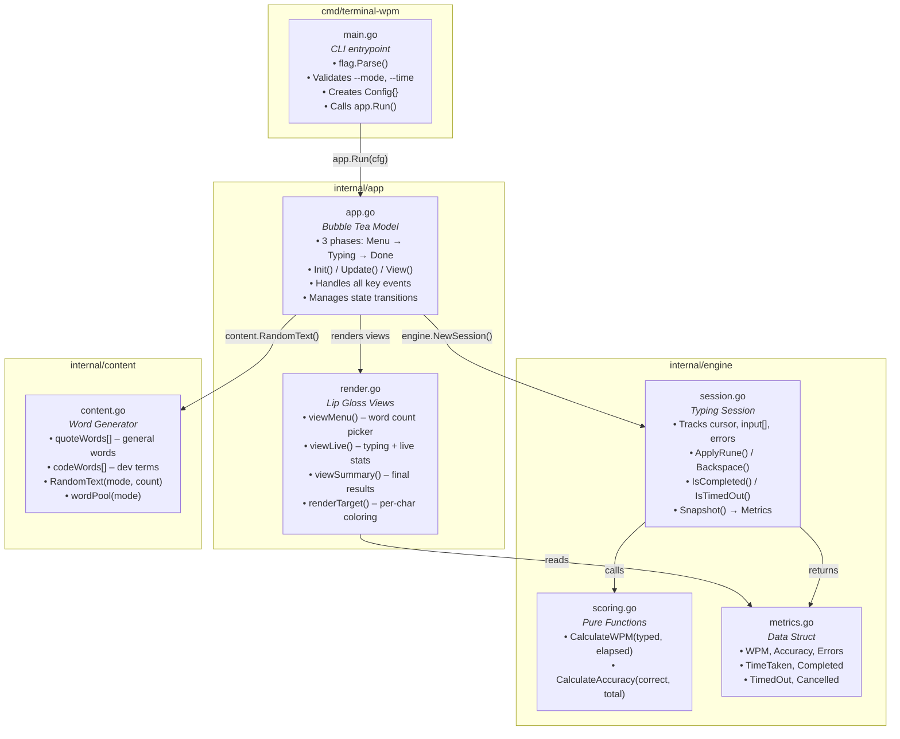
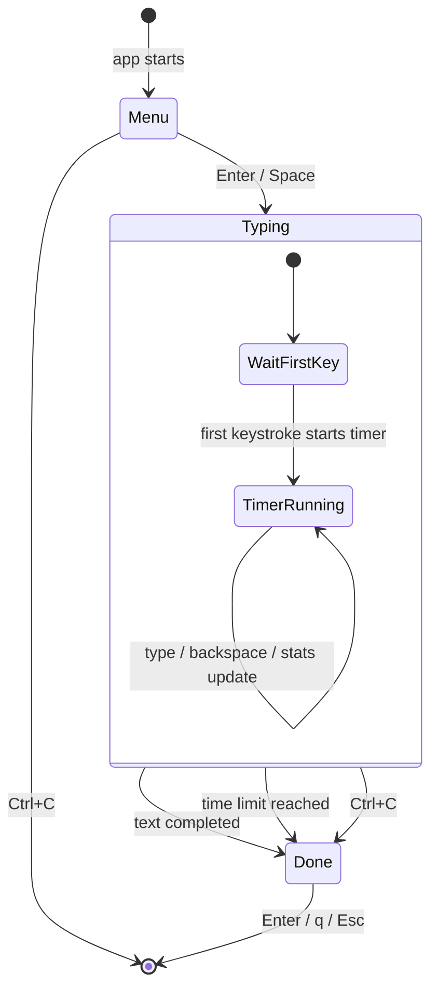

# Architecture – terminal-wpm

A Go learning guide and architecture reference for this project.
Read this top-to-bottom: it teaches Go concepts first, then shows how each one is used in this codebase.

---

## Part 1 — Go Concepts You'll See Here

### 1.1 Packages & Imports

Every `.go` file starts with `package <name>`. Files in the same folder share one package name.

```go
package engine   // all files in internal/engine/ use this
```

You import other packages by path. Standard library paths are short; your own modules use the module name from `go.mod`:

```go
import (
    "fmt"                           // standard library
    "time"                          // standard library
    "terminal-wpm/internal/engine"  // your own package
    tea "github.com/charmbracelet/bubbletea"  // external, with alias "tea"
)
```

**Key rule:** Go only lets you import what you use. Unused imports = compile error.

### 1.2 Exported vs Unexported

In Go, capitalization controls visibility:

```go
type Session struct { ... }   // Exported — other packages can use it
type phase int                // unexported — only this package can see it

func NewSession() *Session    // Exported function (constructor pattern)
func wordPool() []string      // unexported helper
```

This project uses this everywhere:
- `Session`, `Metrics`, `Config` — exported (used across packages)
- `phase`, `model`, `tickMsg` — unexported (internal to `app` package)

### 1.3 Structs & Methods

A struct groups related data. Methods are functions attached to a struct via a **receiver**:

```go
// Struct definition
type Session struct {
    target []rune
    cursor int
    errors int
}

// Method with pointer receiver (can modify the struct)
func (s *Session) Backspace() {
    s.cursor--
}

// Method with value receiver (read-only, returns new copy)
func (s Session) IsCompleted() bool {
    return s.cursor >= len(s.target)
}
```

**When to use `*` (pointer receiver):** when the method modifies the struct's fields.
**When to skip `*` (value receiver):** when the method only reads data.

In this project:
- `Session` uses pointer receivers (`*Session`) for `ApplyRune()`, `Backspace()` — they change state
- `model` uses value receivers for `View()`, `Update()` — Bubble Tea's pattern returns a new model

### 1.4 Interfaces

Go interfaces are implicit — you don't write `implements`. If a type has the right methods, it satisfies the interface automatically:

```go
// Bubble Tea's interface (simplified):
type Model interface {
    Init() Cmd
    Update(Msg) (Model, Cmd)
    View() string
}

// Our model satisfies it just by having these 3 methods:
func (m model) Init() tea.Cmd { ... }
func (m model) Update(msg tea.Msg) (tea.Model, tea.Cmd) { ... }
func (m model) View() string { ... }
```

No `implements` keyword needed — the compiler checks it for you.

### 1.5 Slices & Runes

A **slice** (`[]T`) is Go's dynamic array:

```go
words := make([]string, 0, 30)         // empty slice, capacity 30
words = append(words, "hello")          // add items
```

A **rune** (`rune`) is a single Unicode character (alias for `int32`). Strings in Go are byte sequences, so converting to `[]rune` gives you character-level access:

```go
target := []rune("hello")    // [104, 101, 108, 108, 111]
char := target[0]            // 'h'
```

This project converts the target text to `[]rune` so we can compare character-by-character during typing.

### 1.6 Error Handling

Go doesn't have exceptions. Functions return errors explicitly:

```go
func RandomText(mode string, count int) (string, error) {
    if count <= 0 {
        return "", errors.New("word count must be greater than zero")
    }
    // ... success path
    return result, nil   // nil = no error
}

// Caller always checks:
text, err := content.RandomText(cfg.Mode, cfg.WordCount)
if err != nil {
    return err
}
```

This pattern (`if err != nil`) is the most common Go idiom you'll see.

### 1.7 Type Switch & iota

**Type switch** matches on concrete types inside an interface:

```go
switch typed := msg.(type) {
case tea.KeyMsg:       // it's a key press
case tea.WindowSizeMsg: // terminal was resized
case tickMsg:          // our custom timer tick
}
```

**iota** auto-increments constants (used for simple enums):

```go
const (
    phaseMenu   phase = iota  // 0
    phaseTyping               // 1
    phaseDone                 // 2
)
```

### 1.8 Closures & Higher-Order Functions

A closure captures variables from its surrounding scope:

```go
func tickCmd() tea.Cmd {
    return tea.Tick(80*time.Millisecond, func(t time.Time) tea.Msg {
        return tickMsg(t)   // this anonymous func is a closure
    })
}
```

`tea.Tick` takes a function as an argument — that's a higher-order function pattern.

### 1.9 `internal/` Convention

Anything under `internal/` can only be imported by code within this module. It's Go's built-in encapsulation:

```
terminal-wpm/
├── cmd/            ← can import internal/
├── internal/       ← cannot be imported by outside modules
│   ├── app/
│   ├── engine/
│   └── content/
```

This prevents other projects from depending on your internals.

---

## Part 2 — Project Structure

```
terminal-wpm/
│
├── cmd/
│   └── terminal-wpm/
│       └── main.go              ← CLI entrypoint: flag parsing, config, app.Run()
│
├── internal/
│   ├── app/
│   │   ├── app.go               ← Bubble Tea model: phases, Update(), state transitions
│   │   └── render.go            ← Lip Gloss views: menu, typing, results screens
│   │
│   ├── engine/
│   │   ├── session.go           ← Typing session: cursor, input tracking, timing
│   │   ├── scoring.go           ← Pure functions: CalculateWPM(), CalculateAccuracy()
│   │   ├── metrics.go           ← Data struct: WPM, Accuracy, Errors, etc.
│   │   ├── scoring_test.go      ← Unit tests for scoring
│   │   └── session_test.go      ← Unit tests for session behavior
│   │
│   ├── content/
│   │   └── content.go           ← Word pools + random text generator
│   │
│   └── terminal/
│       ├── console_windows.go   ← Windows raw terminal (legacy, kept for reference)
│       └── console_nonwindows.go
│
├── go.mod                        ← Module definition + dependencies
├── go.sum                        ← Dependency checksums
├── .gitignore
├── README.md
└── ARCHITECTURE.md               ← This file
```

---

## Part 3 — Architecture Diagram



---

## Part 4 — TUI Phase Flow

The app has **3 phases**, all managed inside a single Bubble Tea model:



### Phase Details

| Phase | What happens | Key handling |
|-------|-------------|--------------|
| **Menu** | Shows word-count picker (30/60) | ↑/↓ to move, Enter to start |
| **Typing** | Random words displayed, user types | Printable chars, Backspace, Ctrl+C |
| **Done** | Final results centered on screen | Enter/q/Esc to exit |

---

## Part 5 — Data Flow (per keystroke)

Here's exactly what happens when you press a key during the typing phase:

```
1. User presses 'a'
   │
2. Bubble Tea receives tea.KeyMsg{Runes: ['a']}
   │
3. model.Update() dispatches to updateTyping()
   │
4. session.ApplyRune('a', time.Now())
   │  ├─ First key? → start timer (s.startTime = now)
   │  ├─ Compare 'a' vs target[cursor]
   │  ├─ Match? → correctTyped++
   │  └─ No match? → errors++
   │  └─ cursor++
   │
5. model.View() calls viewLive()
   │  ├─ session.Snapshot() computes live Metrics
   │  ├─ renderTarget() colors each character:
   │  │   ├─ i < cursor, correct → green
   │  │   ├─ i < cursor, wrong   → red
   │  │   ├─ i == cursor         → highlighted block (current)
   │  │   └─ i > cursor          → dim gray
   │  └─ Stats panel: WPM, Accuracy, Elapsed, Errors
   │
6. Bubble Tea renders the string to terminal (in-place, no flicker)
```

---

## Part 6 — Package Responsibilities

### `cmd/terminal-wpm/main.go` — Entrypoint

**Go concepts:** `flag` package, `os.Exit()`, struct literals

```go
// What it does:
// 1. Defines CLI flags (--mode, --time)
// 2. Validates them
// 3. Creates an app.Config struct
// 4. Calls app.Run(cfg)
// That's it — no business logic here.
```

**Why separate?** Go convention puts the binary entrypoint in `cmd/<name>/`. This keeps `main()` tiny and testable logic in packages.

---

### `internal/app/app.go` — Bubble Tea Model

**Go concepts:** interfaces (implicitly satisfying `tea.Model`), type switch, iota enums, pointer vs value receivers, closures

This is the **brain** of the app. It implements Bubble Tea's 3-method interface:

| Method | Purpose |
|--------|---------|
| `Init()` | Returns initial command (nil during menu, tick during typing) |
| `Update(msg)` | Handles events, returns new model + next command |
| `View()` | Returns the full screen as a string |

The `phase` enum controls which screen is active. Each phase has its own update handler (`updateMenu`, `updateTyping`, `updateDone`) — this is **clean separation** without needing separate types.

---

### `internal/app/render.go` — Views

**Go concepts:** `strings.Builder`, Lip Gloss styles, method on struct

Three view functions, one per phase:
- `viewMenu()` — centered box with ▸ selector
- `viewLive()` — text panel + stats panel
- `viewSummary()` — centered results with performance tier

The `renderTarget()` function is the core visual logic — it iterates every rune in the target and applies a style based on position relative to the cursor.

---

### `internal/engine/session.go` — State Machine

**Go concepts:** pointer receiver methods, `[]rune` manipulation, `time.Duration`, encapsulation via unexported fields

This is a **pure state container** — no terminal I/O, no rendering. It:
- Tracks what the user typed (`input []rune`)
- Knows the cursor position
- Counts correct/incorrect/total keystrokes
- Tracks timing (start on first key, optional time limit)
- Produces a `Metrics` snapshot on demand

**Why it's a pointer receiver (`*Session`):** `ApplyRune()` and `Backspace()` modify the struct's fields. If we used a value receiver, changes would be lost.

---

### `internal/engine/scoring.go` — Pure Functions

**Go concepts:** pure functions (no side effects), `time.Duration.Minutes()`

```go
func CalculateWPM(totalTyped int, elapsed time.Duration) float64
func CalculateAccuracy(correct, total int) float64
```

These are **stateless** — given the same inputs, they always return the same output. This makes them trivially testable (see `scoring_test.go`).

---

### `internal/content/content.go` — Word Generator

**Go concepts:** `rand.New()` with seed, `strings.Join()`, `switch` statement, `for range`

Holds two word pools (`quoteWords`, `codeWords`) and randomly picks N words to form the typing target. The `wordPool()` helper maps mode string → slice — a common Go pattern for config-driven behavior.

---

## Part 7 — Key Design Decisions

| Decision | Why |
|----------|-----|
| Bubble Tea for TUI | Structured render loop eliminates flicker; event-driven model fits typing test perfectly |
| Engine has zero I/O | Session and scoring are pure logic — easy to test, no terminal dependency |
| `internal/` packages | Prevents external imports; signals "these are implementation details" |
| Phases as `iota` enum | Simpler than separate model types; one `Update()` dispatches to phase handlers |
| `Snapshot()` returns value | Metrics is a snapshot copy, not a reference — safe to read while session continues |
| Rune-based comparison | Handles multi-byte characters correctly; `[]rune` gives character-level indexing |

---

## Part 8 — Testing Strategy

Tests live alongside the code they test:

```
internal/engine/
├── scoring.go          ← production code
├── scoring_test.go     ← tests for scoring
├── session.go          ← production code
└── session_test.go     ← tests for session
```

Run all tests:
```sh
go test ./...
```

The engine tests are **fast and deterministic** — they inject specific `time.Time` values instead of using `time.Now()`, making timing tests reliable.

---

## Part 9 — Dependencies

| Package | Purpose | Why chosen |
|---------|---------|------------|
| `github.com/charmbracelet/bubbletea` | TUI framework | Structured render loop, cross-platform input |
| `github.com/charmbracelet/lipgloss` | Terminal styling | Declarative styles, borders, colors |
| `golang.org/x/term` | Raw terminal mode | Low-level terminal control (legacy layer) |
| `golang.org/x/sys` | Windows syscalls | Console mode flags for VT support |

Everything else is Go standard library.
